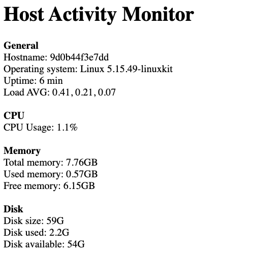

# Docker Multi-Stage Build Example

## Description

This repository represents a simple Java spring web application.  
Originally, initiated using this website: https://start.spring.io/ it's a very good site, highly recommended.  
This app simulates a host activity monitor (such as Windows "Task Manager", Mac "Activity Monitor", or Prometheus + Grafana).  
  
The purpose of this project is to show the `Docker Multi Stage Build` concept and use case.  
The way to show this is to build the Docker image twice: once without multi-stage build, and the other with it, and then compare between the images.  

### Screenshot


### Prerequisites
* Docker  
(preferably on Linux/Mac, since the app uses Linux commands like `free`, `uptime`, `df`, etc...)  

### Usage
#### First step: without multi-stage build
```bash
git clone https://github.com/mr-anderson86/docker-multistage-example.git
cd docker-multistage-example
docker build -t spring-host-status:v1.0.0 .
docker images
# You'll see that the image is ~400 MB

docker run -d --name my-app -p 8080:8080 spring-host-status:v1.0.0
```
Access the web page at http://localhost:8080

#### Second step: with multi-stage build
```bash
# Delete the previous container
docker rm -f my-app

vi Dockerfile
# Comment the "EXPOSE" and "ENTRYPOINT" lines from the first stage
# Uncomment the lines of the second stage, save and quit

docker build -t spring-host-status:v1.0.1 .
docker images
# You'll see that the new image is only ~110 MB
# The runtime doesn't need the packages/libraries used for the compilation stage
# It needs only the host-status.jar file - so it saves a lot of space.

docker run -d --name my-app -p 8080:8080 spring-host-status:v1.0.1
```
Access the web page at http://localhost:8080  
  
### Cleanup
```bash
docker rm -f my-app
docker rmi spring-host-status:v1.0.0 spring-host-status:v1.0.1
```

### The end, enjoy :-)